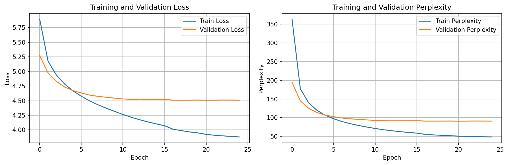
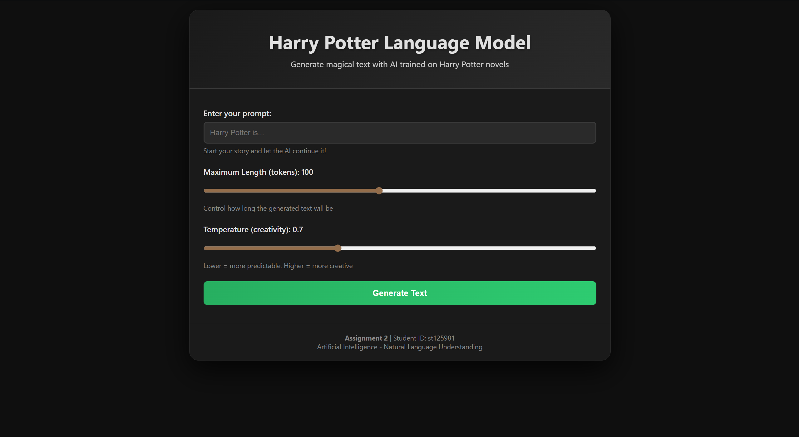
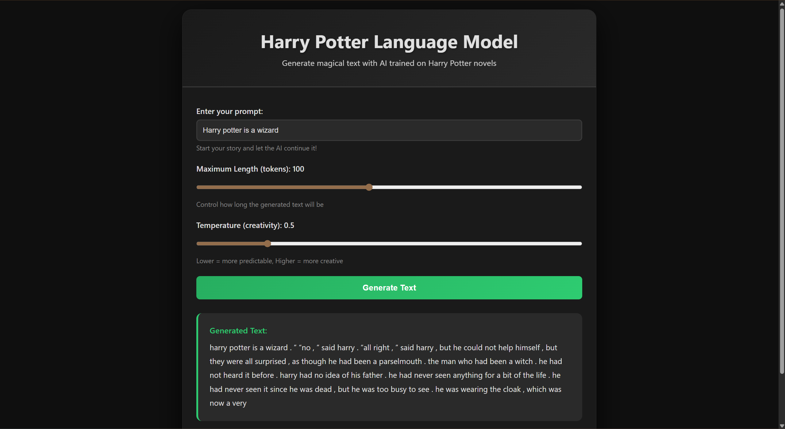
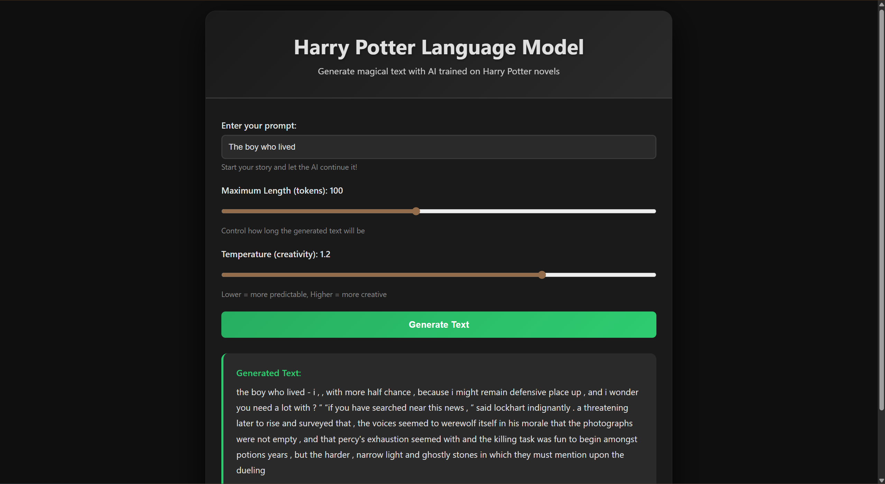

# Assignment 2: Language Model

**Name:** Muhammad Fahad Waqar<br>
**Student ID:** st125981  

---

## Assignment Overview

This project implements a character-level LSTM language model trained on Harry Potter novels to generate contextually relevant text. The project includes a complete training pipeline and an interactive web application for text generation.

### Key Features

- **LSTM-based Language Model** with multi-layer architecture
- **Complete Training Pipeline** with preprocessing and evaluation
- **Interactive Web Application** for real-time text generation
- **Performance Monitoring** with perplexity metrics and visualization
- **Adjustable Generation Parameters** (temperature, length)

---

## Assignment Tasks Completed

### Task 1: Dataset Acquisition (1 point)

**Dataset:** Harry Potter Books

**Source:** Kaggle<br>
**Link:** https://www.kaggle.com/datasets/shubhammaindola/harry-potter-books

**Description:**
The Harry Potter series consists of seven novels with approximately 1 million+ words. The corpus includes:
- Rich narrative fiction with dialogue and descriptions
- Specialized magical terminology
- Consistent writing style throughout the series
- Sufficient size for training effective language models

**Dataset Characteristics:**
- **Total Tokens:** ~1,000,000+ words
- **Vocabulary Size:** Variable based on preprocessing (min_freq=3)
- **Structure:** Chapter-based organization

### Task 2: Model Training

#### Task 2.1: Data Preprocessing

The preprocessing pipeline consists of the following steps:

1. **Text Cleaning**
   - Remove excessive whitespace
   - Normalize line breaks
   - Strip leading/trailing whitespace
   - This is done to standardize text format for consistent tokenization

2. **Tokenization**
   - Using the `basic_english` tokenizer from torchtext
   - Splits on whitespace and handles punctuation
   - Converts to lowercase
   - To convert raw text into discrete tokens (words)

3. **Vocabulary Building**
   - Build vocabulary from tokenized text
   - Set minimum frequency threshold (min_freq=3) to filter rare words
   - Add special tokens: `<unk>` (unknown), `<eos>` (end of sequence)
   - Set default index to `<unk>` for out-of-vocabulary words
   - To create a mapping between tokens and numerical indices

4. **Numericalization**
   - Convert each token to its vocabulary index
   - Add `<eos>` tokens to mark sequence boundaries
   - Create PyTorch tensors
   - To transform text into numerical format for neural network input

5. **Batch Preparation**
   - Reshape data into [batch_size, sequence_length] tensors
   - Split into train/validation/test sets (80%/10%/10%)
   - Ensure all batches are complete (trim incomplete sequences)
   - This is done to organize data for efficient batch training

#### Task 2.2: Model Architecture and Training

**Model Architecture:**

The LSTM Language Model consists of:

1. **Embedding Layer**
   - Converts token indices to dense vector representations
   - Dimension: 256 (configurable)
   - For learning meaningful representations of words

2. **LSTM Layers**
   - 2 stacked LSTM layers
   - Hidden dimension: 512 (configurable)
   - Maintains hidden state across sequences
   - to capture sequential dependencies and context

3. **Dropout Regularization**
   - Dropout rate: 0.5
   - Applied after embedding and LSTM output
   - Prevents overfitting and improve generalization

4. **Output Layer**
   - Fully connected layer
   - Projects LSTM output to vocabulary size
   - Predicting the probability distribution over next tokens

**Architecture Flow:**
```
Input [batch_size, seq_len]
  ↓
Embedding [batch_size, seq_len, emb_dim=256]
  ↓
LSTM Layers [batch_size, seq_len, hid_dim=512]
  ↓
Dropout
  ↓
Output Layer [batch_size, seq_len, vocab_size]
```

**Training Process:**

1. **Hyperparameters:**
   - Batch size: 32
   - Sequence length: 30
   - Learning rate: 0.001 (Adam optimizer)
   - Gradient clipping: 0.25
   - Number of epochs: 20

2. **Training Loop:**
   - Extract source and target sequences (target = source shifted by 1)
   - Forward pass through model
   - Compute CrossEntropyLoss
   - Backward pass with gradient computation
   - Gradient clipping to prevent exploding gradients
   - Weight update with Adam optimizer

3. **Hidden State Management:**
   - Initialize hidden state at epoch start
   - Detach hidden state between batches to prevent backprop through entire history
   - Maintains context within epoch while controlling memory usage

4. **Learning Rate Scheduling:**
   - ReduceLROnPlateau scheduler
   - Reduces learning rate by factor of 0.5 when validation loss plateaus
   - Patience: 2 epochs

5. **Evaluation Metric:**
   - **Perplexity:** exp(loss)
   - Lower perplexity indicates better model performance
   - Perplexity represents the model's "confusion" - lower is better

6. **Model Checkpointing:**
   - Save model when validation loss improves
   - Enables recovery of best model for inference

#### Training Results

The model was trained for 25 epochs with the following results:



The plots show:
- **Left plot:** Training and validation loss over epochs
  - Training loss decreases from ~5.9 to ~3.9
  - Validation loss stabilizes around ~4.5
- **Right plot:** Training and validation perplexity over epochs
  - Training perplexity decreases from ~365 to ~50
  - Validation perplexity stabilizes around ~90

The model shows good learning progress with decreasing loss and perplexity. The gap between training and validation metrics indicates some overfitting, which is expected with a complex model on a literary dataset.

### Task 3: Web Application Development (2 points)

#### Application Features

1. **Input Box for Text Prompts**
   - Users can enter any text prompt to continue
   - Example prompts provided for convenience
   - Input validation to ensure non-empty prompts

2. **Text Generation with Continuation**
   - Model generates continuation based on input
   - Autoregressive generation: each predicted token becomes input for next prediction
   - Example: Input "Harry Potter is" → Output "harry potter is a young wizard who lives with his aunt and uncle..."

3. **Adjustable Parameters**
   - **Maximum Length Slider:** Control how many tokens to generate (20-200)
   - **Temperature Slider:** Control randomness/creativity (0.3-1.5)
     - Lower temperature (0.3-0.6): More predictable, coherent text
     - Medium temperature (0.7-0.9): Balanced creativity
     - Higher temperature (1.0-1.5): More diverse, creative output

4. **Real-time Generation**
   - Interactive interface with instant feedback
   - Loading indicator during generation
   - Results displayed with proper formatting

5. **User-Friendly Interface**
   - Modern, responsive design
   - Harry Potter themed colors
   - Clear instructions and example prompts
   - Error handling with user-friendly messages

#### How the Web Application Interfaces with the Language Model

**Architecture Overview:**

```
     User Interface
          ↓
    Flask Backend (app.py)
          ↓
   LSTM Language Model
          ↓
   Text Generation Function
          ↓
    Response to Frontend
```

**Detailed Interface Process:**

1. **Model Loading (Startup)**
   ```python
   # Load saved model components
   - Configuration (vocab_size, emb_dim, hid_dim, etc.)
   - Vocabulary (token-to-index mapping)
   - Trained model weights
   ```

2. **Frontend → Backend Communication**
   - User enters prompt in web interface
   - JavaScript sends POST request to `/generate` endpoint
   - Request includes: prompt text, max_length, temperature
   - JSON format ensures structured data transfer

3. **Backend Processing**
   ```python
   # Flask route handler
   1. Receive JSON request with parameters
   2. Validate inputs (non-empty prompt, valid ranges)
   3. Call generate_text() function
   4. Return JSON response with generated text
   ```

4. **Text Generation Process**
   ```python
   def generate_text(prompt, max_length, temperature):
       # Tokenization
       tokens = tokenizer(prompt)  # Convert text to tokens
       indices = [vocab[t] for t in tokens]  # Map to indices
       
       # Initialize hidden state
       hidden = model.init_hidden(batch_size=1, device)
       
       # Autoregressive generation loop
       for i in range(max_length):
           # Forward pass
           prediction, hidden = model(current_input, hidden)
           
           # Apply temperature scaling
           probs = softmax(prediction[:, -1] / temperature)
           
           # Sample next token
           next_token = multinomial(probs)
           
           # Add to sequence (autoregressive)
           indices.append(next_token)
           
           # Stop conditions
           if next_token == <eos>: break
       
       # Convert back to text
       return ' '.join(tokens)
   ```

5. **Key Components:**

   a. **Tokenizer:**
      - Converts text to tokens using same method as training
      - Ensures consistency between training and inference

   b. **Vocabulary:**
      - Maps tokens to numerical indices
      - Handles unknown tokens with `<unk>`

   c. **Temperature Scaling:**
      - Divides logits by temperature before softmax
      - Controls randomness of sampling:
        - Low temp → peaked distribution → deterministic
        - High temp → flat distribution → random

   d. **Autoregressive Generation:**
      - Each predicted token becomes input for next prediction
      - Model maintains hidden state across predictions
      - Enables coherent, contextual text generation

   e. **Stopping Conditions:**
      - Stop when `<eos>` token generated
      - Stop when maximum length reached
      - Prevents infinite generation

6. **Response Handling**
   - Backend returns JSON with generated text
   - Frontend JavaScript updates UI with result
   - Error handling for network issues or generation failures


## Running the Web Application

### Step 1: Ensure Model is Trained

Make sure you've run the notebook and generated model files in `app/models/`:
- `best_harry_potter_lm.pt`
- `vocab.pkl`
- `config.pkl`

### Step 2: Navigate to App Directory

```bash
cd app
```

### Step 3: Run Flask Server

```bash
python app.py
```

The server will start on `http://localhost:5000`

### Step 4: Access the Web Interface

1. Open your web browser
2. Navigate to `http://localhost:5000`
3. You should see the Harry Potter Language Model interface

### Using the Web App

1. **Enter a Prompt:** Type your starting text (e.g., "Harry Potter is")
2. **Adjust Parameters:**
   - **Max Length:** How many tokens to generate
   - **Temperature:** Creativity level (0.3 = conservative, 1.5 = creative)
3. **Click "Generate Text"**
4. **View Results:** Generated text appears below the form

---

## Application Screenshots

### Main Interface



---

### Text Generation Example 1 - Conservative (Low Temperature)



---

### Text Generation Example 2 - Creative (High Temperature)



---